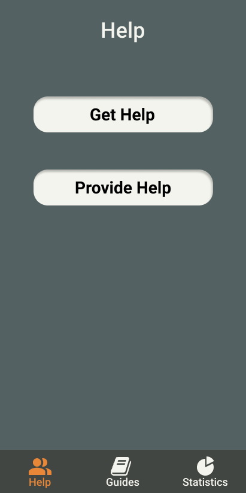
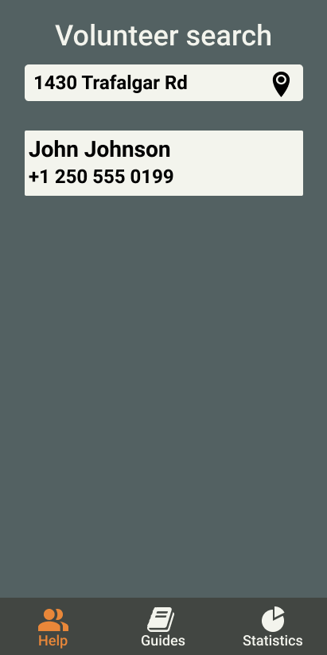
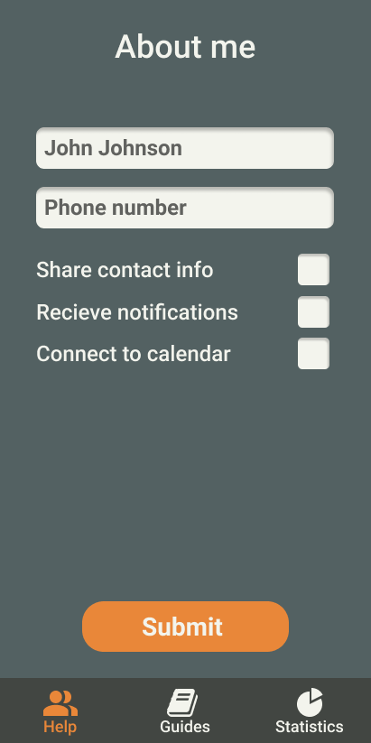
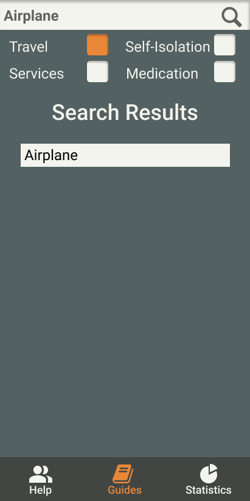
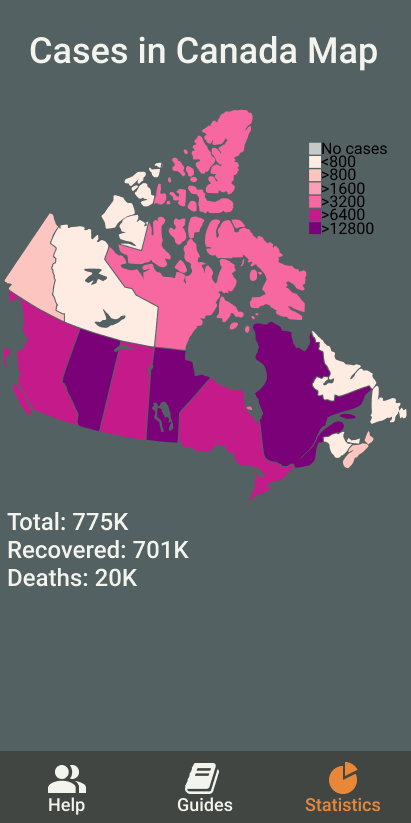

# COVID-19 application

## About

A volunteering application suited specifically for getting and providing help during the COVID-19 pandemic. The application allows volunteers to find those who need help, such as senior citizens, handicapped people and anyone else, connecting the two together.

In addition to that, the application provides an extensive list of guides related to the pandemic, enabling users to search, rate and edit them similar to Wikipidea articles.

Finally, the app also reports real-time statistics regarding the COVID-19 cases in various areas of Canada.

## Resources

- [Interactive public prototype (Version 1)](https://www.figma.com/file/IhSm32vgboWVhIHyG4de1A/Assignment-2?node-id=0%3A1)

- [Interactive public prototype (Version 2)](https://www.figma.com/proto/Exqx1Nugzn7ZAHpijgxwIE/Assignment-3?node-id=0%3A1&scaling=scale-down&page-id=0%3A1)

- [Narrated video presentation](https://sheridanc-my.sharepoint.com/:v:/g/personal/pyevnyev_shernet_sheridancollege_ca/EeuhK5mml25Hsx3DW7lYbNMBk4LA8np1b20HFq8XxYD51g?e=pXxe04) - For Sheridan College members only (Uploaded to OneDrive)

## Top 5 New Desirable Features

1. Automatically showing statistics from the user’s specific region based on their current location (retrieved from the geolocation service).

2. Allowing volunteers to set preferences regarding what kind of requests they are going to be receiving when searching their local area (Not showing any requests that ask for medical help / prioritizing food delivery).

3. Integrating the application with various messengers for communicating through them when calling and receiving calls (Specifying which one to use / Using regular phone calls and text messages).

4. Connecting volunteers’ profiles to their external resumes / volunteering history records and updating them according to their accomplishments and activity they performed through the application.

5. Integrating the guides with various corresponding wikipedia articles and health organization articles so that any changes made on the either side are reflected (When a guide is edited in the application the changes are shown outside and vice-versa).

## Sections

### Help

Depending on whether the user is someone who gives help or asks for help, the application is either going to allow them to search for help requests in their area or enable them to fill out a request for help.

Alternatively, handicapped can also reach the call-center via a phone call in order to have their request details filled out for them.

In addition to that, elderly people can also contact certain volunteers in their area directly if they publish their contact information.

#### Screenshots

##### Getting help

##### Searching for volunteers

##### Providing help

##### Searching for volunteering requests

### Guides

Here, all kinds of users can search for specific guides in order to find out how to handle various situtations during the quarantine by searching using specific keywords or navigating through appropriate sections.

The users can also report guides as useful or not useful in order to change their rating for other users to see. Optionally, experts can also ask for the guides to be changed by providing necessary comments in a prompt.

#### Screenshots

##### Guides search

##### Adding a guide

### Statistics

The application presents users statistics regarding the COVID-19 cases in various regions, as well as globally in Canada, and shows corresponding graphs to see current trends.

#### Screenshots

##### Global statistics

##### Regional statistics

